# Patient Assistant AI System — Cleopatra Hospital
## Business Plan

**Version:** 2.0
**Date:** June 2026
**Status:** Planning Phase
**Confidential**

---

## Table of Contents

1. [Executive Summary](#1-executive-summary)
2. [Problem Statement](#2-problem-statement)
3. [Solution Overview](#3-solution-overview)
4. [System Architecture](#4-system-architecture)
5. [Data Strategy](#5-data-strategy)
6. [Agent Design](#6-agent-design)
7. [Technical Stack](#7-technical-stack)
8. [Data Management & Cleanup](#8-data-management--cleanup)
9. [Implementation Roadmap](#9-implementation-roadmap)

---

## 1. Executive Summary

**Patient Assistant AI** is an intelligent, multi-agent conversational system designed to transform the patient experience at Cleopatra Hospital. The system eliminates critical pain points: excessive waiting times, lack of persistent patient history across interactions, and fragmented routing of medical, booking, complaint, emergency, medical tourism, and loyalty/retention queries.

The system deploys a set of specialized AI agents — each responsible for a distinct data domain or workflow — enabling patients to receive accurate, personalized, and instant responses through any channel (chat, voice, WhatsApp, web). Payment-related requests are intentionally handed off to a human agent rather than automated, given the sensitivity of financial transactions.

**Core Value Proposition:**
- Reduce patient service wait time by up to 70%
- Eliminate "starting from scratch" in every patient interaction
- Deliver medically accurate, specialty-aware responses 24/7
- Automate complaint tracking and follow-up
- Triage emergencies and give immediate first-aid guidance while routing to human care
- Support international patients seeking medical tourism services
- Reward and retain loyal patients through tier-based perks and personalized offers

---

## 2. Problem Statement

### 2.1 Current Pain Points

| Pain Point | Impact |
|---|---|
| Long waiting times (booking, inquiries, complaints) | Patient dissatisfaction, churn |
| No persistent patient history | Repeated data collection, errors |
| Staff overload on routine queries | High operational cost |
| Inconsistent information across channels | Patient confusion and distrust |
| Manual complaint tracking | Unresolved issues, poor reputation |
| No emergency triage in digital channels | Delayed urgent care, safety risk |
| No structured support for medical tourism patients | Lost international revenue, poor experience |

### 2.2 Root Causes

- **No centralized knowledge layer** connecting patient data, doctor schedules, and medical information
- **No session continuity** — each interaction starts fresh with no memory of prior context
- **Siloed data sources** — CRM, booking, complaints, and medical knowledge exist in separate, disconnected systems
- **No intelligent routing** — every query goes to a human agent regardless of complexity
- **No emergency-aware logic** — urgent symptoms are treated the same as routine inquiries

### 2.3 Opportunity

Healthcare facilities that deploy AI-assisted patient services report:
- 40–60% reduction in call center volume
- 30% improvement in patient satisfaction scores
- 25% increase in appointment booking conversions

---

## 3. Solution Overview

### 3.1 What We're Building

A **multi-agent AI system** that acts as a 24/7 intelligent patient assistant — capable of:

- Booking, rescheduling, and canceling appointments, with full doctor information and per-doctor requirements
- Answering medical specialty and disease questions
- Logging and tracking complaints end-to-end
- Maintaining full patient history and CRM context
- Managing session continuity across conversations (as shared context data, not a separate agent)
- Performing emergency triage and providing first-aid guidance
- Supporting medical tourism inquiries (packages, logistics, travel-related medical info)
- Tracking loyalty tiers, points, and personalized rewards for returning patients
- Handing off payment and billing requests to a human agent
- Cleaning and organizing data automatically on a schedule

### 3.2 Key Differentiators

- **Specialty-aware agents** — each medical specialty (Cardiology, Orthopedics, Dermatology, etc.) has its own dedicated agent with its own knowledge base
- **Persistent memory** — patients never repeat themselves; the system knows their history via shared session context
- **Unified Booking & Doctor Agent** — booking, doctor profiles, and per-doctor requirements live in one agent for consistent answers
- **Shared doctor data access** — every specialty agent, the Emergency Agent, and the Medical Tourism Agent can read the Doctor & Bookings DB to check availability and requirements in real time
- **Emergency triage** — urgent symptoms are flagged early, given first-aid guidance, and escalated appropriately
- **Medical tourism support** — international patients get tailored guidance on treatment packages and logistics
- **Loyalty-aware experience** — returning patients get tier-based perks, points tracking, and personalized offers automatically
- **Safe payment handling** — all billing/payment requests are routed to a human agent, not automated
- **Automatic data hygiene** — scheduled cleanup and archiving keeps the system fast and compliant

---

## 4. System Architecture

### 4.1 High-Level Flow

```mermaid
---
config:
  layout: elk
---
flowchart TD
    Patient["👤 Patient<br/>(Chat / Voice / WhatsApp / Web)"]

    Orchestrator["🎯 Orchestrator Agent<br/>(Intent Routing)"]
    Patient --> Orchestrator

    BookingAgent["📅 Booking & Doctor<br/>Agent"]
    ComplaintAgent["📝 Complaint Agent"]
    CRMAgent["👥 CRM Agent"]
    EmergencyAgent["🚨 Emergency Agent<br/>(Triage + First Aid)"]
    MedTourismAgent["✈️ Medical Tourism<br/>Agent"]
    LoyaltyAgent["⭐ Loyalty & Retention<br/>Agent"]
    HandoffAgent["👨‍💼 Human Agent<br/>Handoff"]

    Orchestrator --> BookingAgent
    Orchestrator --> ComplaintAgent
    Orchestrator --> CRMAgent
    Orchestrator --> SpecialtySubgraph
    Orchestrator --> EmergencyAgent
    Orchestrator --> MedTourismAgent
    Orchestrator --> LoyaltyAgent
    Orchestrator -->|"Payment / Billing /<br/>Point Redemption"| HandoffAgent

    subgraph SpecialtySubgraph["🏥 Specialty Medical Agents RAG"]
        GenMed["General Medicine"]
        Cardio["Cardiology"]
        Ortho["Orthopedics"]
        Derm["Dermatology"]
        Peds["Pediatrics"]
        GynObs["Gynecology &<br/>Obstetrics"]
        Neuro["Neurology"]
        Onco["Oncology"]
        ENT["ENT"]
        Ophthal["Ophthalmology"]
        Psych["Psychiatry"]
    end

    DoctorDB[("Doctor & Bookings<br/>DB")]
    ComplaintsDB[("Complaints DB")]
    CrmDB[("Patient CRM")]
    EmergencyKB[("Emergency Triage<br/>KB")]
    MedTourismDB[("Medical Tourism<br/>Data")]
    SpecialtyKB[("Specialty Knowledge<br/>Bases Vector DB")]
    LoyaltyDB[("Loyalty Program<br/>DB")]

    BookingAgent <-->|"read/write"| DoctorDB
    ComplaintAgent <-->|"read/write"| ComplaintsDB
    CRMAgent <-->|"read/write"| CrmDB

    SpecialtySubgraph -->|"read-only:<br/>availability &<br/>requirements"| DoctorDB
    SpecialtySubgraph -->|"reads"| SpecialtyKB

    EmergencyAgent -->|"reads"| EmergencyKB
    EmergencyAgent -->|"read-only"| DoctorDB

    MedTourismAgent -->|"reads"| MedTourismDB
    MedTourismAgent -->|"read-only"| DoctorDB

    LoyaltyAgent -->|"reads tier,<br/>history"| CrmDB
    LoyaltyAgent <-->|"read/write"| LoyaltyDB

    LoyaltyAgent -.->|"apply priority<br/>slots / discounts"| BookingAgent
    LoyaltyAgent -.->|"apply returning-<br/>patient perks"| MedTourismAgent

    classDef orchestrator fill:#eef2ff,stroke:#818cf8,stroke-width:3px
    classDef agent fill:#ecfeff,stroke:#38bdf8,stroke-width:2px
    classDef specialty fill:#f0fdfa,stroke:#2dd4bf,stroke-width:2px
    classDef emergency fill:#fef2f2,stroke:#f87171,stroke-width:2px
    classDef tourism fill:#fff7ed,stroke:#fb923c,stroke-width:2px
    classDef loyalty fill:#fdf2f8,stroke:#f472b6,stroke-width:2px
    classDef handoff fill:#fefce8,stroke:#facc15,stroke-width:2px
    classDef database fill:#f3f4f6,stroke:#6b7280,stroke-width:2px
    classDef patient fill:#f5f3ff,stroke:#a78bfa,stroke-width:2px

    class Orchestrator orchestrator
    class BookingAgent,ComplaintAgent,CRMAgent agent
    class GenMed,Cardio,Ortho,Derm,Peds,GynObs,Neuro,Onco,ENT,Ophthal,Psych specialty
    class EmergencyAgent emergency
    class MedTourismAgent tourism
    class LoyaltyAgent loyalty
    class HandoffAgent handoff
    class DoctorDB,ComplaintsDB,CrmDB,EmergencyKB,MedTourismDB,SpecialtyKB,LoyaltyDB database
    class Patient patient
```



**Shared data access:** the Booking & Doctor Agent owns read/write access to the Doctor & Bookings DB. Specialty Agents, the Emergency Agent, and the Medical Tourism Agent each have **read-only** access to the same DB, so they can check doctor availability and requirements without leaving their own conversation flow. Any actual booking, reschedule, or cancellation is handed off to the Booking & Doctor Agent. The Loyalty & Retention Agent reads patient history from the CRM (read-only) and owns the Loyalty Program DB (read/write); it coordinates with the Booking & Doctor Agent and Medical Tourism Agent to apply tier-based perks at the point of booking.

### 4.2 Interaction Lifecycle

```
1. Patient sends message
2. Orchestrator identifies intent, reads session context
3. Relevant agent(s) are called with patient context from CRM + session data
4. Agent queries its data source
5. If intent is payment/billing → Orchestrator hands off to human agent
6. If intent is emergency → Emergency Agent triages, gives first-aid guidance,
   and escalates to human staff if needed
7. Response is synthesized and returned
8. Session context is updated with the interaction
9. CRM is updated if patient data changed
```

---

## 5. Data Strategy

### 5.1 Core Data Sources

#### Source 1 — Doctor & Bookings Data
- Doctor profiles (specialties, availability, location, rating)
- Per-doctor requirements (e.g., referral needed, pre-visit tests, documents to bring)
- Appointment slots (available, booked, cancelled)
- Real-time queue and estimated wait times
- Booking history per patient
- **Access model:** read/write by the Booking & Doctor Agent; **read-only** by all Specialty Agents, the Emergency Agent, and the Medical Tourism Agent

#### Source 2 — Complaints Data
- Complaint records (type, date, status, resolution)
- Escalation rules and SLA timers
- Assigned staff or department
- Patient satisfaction post-resolution

#### Source 3 — Patient CRM Data
- Patient demographics and contact info
- Medical history summary (non-clinical)
- Past appointments and doctors visited
- Preferences (language, communication channel)
- Last interaction timestamp and notes
- Loyalty tier reference (read by Loyalty & Retention Agent; tier value itself lives in Source 8)

#### Source 4 — Hospital & Medical Knowledge Base (Specialty-Scoped)
- Hospital departments and services
- Disease descriptions and symptoms, organized into per-specialty collections (Cardiology, Orthopedics, Dermatology, Pediatrics, Gynecology & Obstetrics, Neurology, Oncology, ENT, Ophthalmology, Psychiatry, General Medicine)
- Specialty routing rules ("chest pain → Cardiology")
- FAQs, policies, insurance information
- Treatment procedures (general information only)

#### Source 5 — Session Context (Data, not an Agent)
- Active conversation context (last N turns)
- Current intent and collected entities
- Mid-flow state (e.g., patient is mid-booking)
- Temporary flags (e.g., "already verified identity")
- Stored in Redis, read/written directly by the Orchestrator and other agents — no dedicated Session Agent

#### Source 6 — Emergency Triage Knowledge Base
- Symptom-based urgency rules (red flags vs. non-urgent)
- First-aid guidance content
- Escalation/handoff rules to human emergency staff

#### Source 7 — Medical Tourism Data
- Treatment packages for international patients
- Pricing tiers (general info; detailed billing → human handoff)
- Travel logistics (visa support info, accommodation partners, airport transfer)
- Language and concierge preferences

#### Source 8 — Loyalty Program Data
- Patient loyalty tier (Standard, Silver, Gold, Platinum)
- Points/credits balance and transaction history
- Available rewards and perks per tier
- Referral and review tracking
- Re-engagement flags for inactive high-value patients

### 5.2 Data Flow Diagram

```
[Patient] ──► [Session Context (Redis)] ──► read/written by Orchestrator
                    │                          and agents directly
                    ▼
[CRM Agent] ──► pulls patient profile ──► enriches all agent responses
                    │
   ┌────────────┬───┴────────────┬──────────────┬──────────────┬────────────┐
   ▼            ▼                ▼              ▼              ▼            ▼
[Booking &  [Complaint  [Specialty Agents:    [Emergency     [Medical    [Loyalty &
 Doctor       Agent]     Cardiology,           Agent]         Tourism     Retention
 Agent]      reads/      Orthopedics,          reads Triage    Agent]      Agent]
 reads/      writes      Dermatology, ...]     KB, escalates   reads       reads CRM
 writes      Complaints  reads specialty       to human staff  Tourism     (read-only),
 Doctor &    DB          KB (RAG)                               data,       reads/writes
 Bookings DB                │                                   logistics   Loyalty
        ▲                   │                                               Program DB
        │   read-only        │   read-only
        └───────────────────┴──────────────┬───────────────┘
                                             │
                              (Specialty Agents, Emergency Agent,
                               and Medical Tourism Agent all read
                               Doctor & Bookings DB for availability
                               and per-doctor requirements)

[Loyalty & Retention Agent] ──► coordinates with Booking & Doctor Agent
                                 (priority slots/discounts) and Medical
                                 Tourism Agent (returning-patient perks)

[Payment / Billing intent, including point redemption] ──► Orchestrator ──► Human Agent Handoff
(no dedicated agent / automated processing)
```

---

## 6. Agent Design

### 6.1 Orchestrator Agent

**Role:** Intent classifier and router

**Responsibilities:**
- Understand the patient's query using shared session context
- Identify which agent(s) to invoke
- Merge responses from multiple agents if needed
- Detect payment/billing intent and hand off directly to a human agent
- Detect emergency intent and prioritize routing to the Emergency Agent
- Handle fallback if no agent can answer

**Intent Categories:**

| Intent | Routed To |
|---|---|
| Book / reschedule / cancel appointment | Booking & Doctor Agent |
| Ask about a doctor / doctor requirements | Booking & Doctor Agent, or relevant Specialty Agent |
| File or check a complaint | Complaint Agent |
| Ask about patient history | CRM Agent |
| Ask about disease / symptoms (non-urgent) | Relevant Specialty Agent (e.g., Cardiology, Orthopedics) |
| Symptom unclear / general inquiry | General Medicine Agent (re-routes if needed) |
| Urgent symptoms / emergency | Emergency Agent |
| General hospital info | Relevant Specialty Agent |
| Medical tourism / treatment packages / travel | Medical Tourism Agent |
| Loyalty tier / points / rewards / offers | Loyalty & Retention Agent |
| Payment / billing / invoices / point redemption | Human Agent Handoff (no AI agent) |
| Multi-turn follow-up | Resolved via shared session context |

---

### 6.2 Booking & Doctor Agent

**Data Source:** Doctor & Bookings DB

**Capabilities:**
- Check doctor availability by specialty, date, or doctor name
- Provide full doctor profiles (specialty, rating, location, bio)
- Provide per-doctor requirements (referrals, required tests, documents to bring)
- Book, reschedule, or cancel appointments
- Provide real-time waiting time estimates
- Send confirmation (SMS / Email / WhatsApp)

**Key Logic:**
- Always checks patient identity via CRM Agent before booking
- Records every booking action in Bookings DB
- Updates session context directly on booking state changes (no separate Session Agent call)

---

### 6.3 Complaint Agent

**Data Source:** Complaints DB

**Capabilities:**
- Log new complaints with auto-generated ticket ID
- Check complaint status by ticket ID or patient ID
- Escalate complaints that exceed SLA
- Close resolved complaints and request satisfaction rating

**Escalation Rules:**

| Priority | SLA | Escalation To |
|---|---|---|
| Low | 72 hours | Department Head |
| Medium | 24 hours | Operations Manager |
| High | 4 hours | Hospital Director |
| Critical | 1 hour | Immediate human handoff |

---

### 6.4 CRM Agent

**Data Source:** Patient CRM

**Capabilities:**
- Retrieve full patient profile on every interaction
- Update patient contact info, preferences, and notes
- Provide patient history to all other agents as context
- Solve the **No History** problem — every agent has patient context

**Privacy Rules:**
- No clinical diagnosis data stored in CRM (only visit summaries)
- Access requires patient ID + verification step
- All access events are logged

---

### 6.5 Specialty Medical Agents (RAG + Doctor & Bookings Access)

Instead of one generic Medical Agent, each medical specialty is served by its **own specialized agent**. Every specialty agent has two data connections:

1. **Specialty Knowledge Base (RAG)** — diseases, symptoms, treatments, and FAQs scoped to that specialty
2. **Doctor & Bookings DB (read access)** — to check doctor availability, schedules, and per-doctor requirements for that specialty, so the agent can answer "which doctor handles this?" and "what do I need before my visit?" in the same turn

**Specialty Agents:**

- General Medicine Agent
- Cardiology Agent
- Orthopedics Agent
- Dermatology Agent
- Pediatrics Agent
- Gynecology & Obstetrics Agent
- Neurology Agent
- Oncology Agent
- ENT Agent (Ear, Nose & Throat)
- Ophthalmology Agent
- Psychiatry Agent

**Shared Capabilities (every specialty agent):**
- Answer questions about diseases, symptoms, and treatments within its specialty (non-urgent)
- Check doctor availability, schedule, and wait times for doctors in its specialty
- Surface per-doctor requirements (referrals, pre-visit tests, documents to bring) directly from the Doctor & Bookings DB
- Hand off to the Booking & Doctor Agent to actually book, reschedule, or cancel an appointment
- Provide hospital policies, insurance, and service information relevant to the specialty

**RAG Pipeline (per specialty):**

```
Patient question
      │
      ▼
Orchestrator routes to specialty agent (e.g., Cardiology)
      │
      ▼
Query embedding (embedding model)
      │
      ▼
Vector similarity search — specialty-scoped collection (ChromaDB / pgvector)
      │
      ▼
Top-K relevant chunks retrieved
      │
      ▼
Specialty agent checks Doctor & Bookings DB
  (availability + per-doctor requirements, read-only)
      │
      ▼
LLM generates answer grounded in retrieved chunks + doctor data
      │
      ▼
Response with source reference
```

**Key Logic:**
- Specialty agents have **read-only** access to the Doctor & Bookings DB — they never write bookings directly
- If the patient wants to book, the specialty agent hands off to the Booking & Doctor Agent (which performs the write)
- The Orchestrator routes by detected specialty; if the specialty is unclear, it defaults to the General Medicine Agent, which can re-route once symptoms are clarified

---

### 6.6 Emergency Agent

**Data Source:** Emergency Triage Knowledge Base + Doctor & Bookings DB (read access)

**Capabilities:**
- Triage incoming symptoms to assess urgency (red flag detection)
- Provide immediate, general first-aid guidance for common emergencies
- Identify priority level of the patient's condition
- Check Doctor & Bookings DB (read-only) for on-call/ER doctor availability when escalating
- Escalate critical cases immediately to human emergency staff / direct patient to call emergency services or visit ER
- Never provide a diagnosis — guidance only, with clear disclaimers

**Triage Priority Levels:**

| Priority | Description | Action |
|---|---|---|
| Critical | Life-threatening symptoms (e.g., chest pain, severe bleeding, difficulty breathing) | Immediate instruction to call emergency services / go to ER + human handoff |
| Urgent | Serious but not immediately life-threatening | First-aid guidance + recommend same-day ER/urgent care visit |
| Non-urgent | Manageable symptoms | General advice + route to Medical Agent or Booking & Doctor Agent for appointment |

---

### 6.7 Medical Tourism Agent

**Data Source:** Medical Tourism Data

**Capabilities:**
- Provide information on treatment packages designed for international patients
- Answer logistics questions (travel, accommodation partners, airport transfer, visa support info)
- Provide general pricing/package tiers (detailed billing handled by human agent)
- Coordinate with Booking & Doctor Agent for appointment scheduling
- Support multilingual interactions for international patients

---

### 6.8 Payment / Billing — Human Handoff

**Not an AI agent.** Any payment, billing, invoice, refund, or insurance-claim-payment query detected by the Orchestrator is routed directly to a human staff member. The AI system does not process, calculate, or confirm financial transactions.

---

### 6.9 Session Context (Shared Data Layer)

**Not an agent — a shared data store (Redis / PostgreSQL).**

**Function:**
- Store and retrieve active conversation context
- Track multi-turn intent state (e.g., mid-booking flow)
- Read and written directly by the Orchestrator and all other agents
- Expire and clean sessions on schedule (24-hour inactivity → hard delete)

---

### 6.10 Loyalty & Retention Agent

**Data Source:** Loyalty Program DB + Patient CRM (read access)

**Capabilities:**
- Track patient loyalty tier (e.g., Standard, Silver, Gold, Platinum) based on visit frequency, spend, and tenure
- Award and track points/credits for completed appointments, referrals, and reviews
- Inform patients of their current tier, points balance, and available rewards
- Notify patients of applicable perks during booking (priority slots, discounted services, fast-track check-in)
- Surface personalized offers (e.g., free checkup, specialist discount) based on tier and history
- Flag long-inactive high-value patients for re-engagement campaigns (handled by marketing/CRM team)

**Key Logic:**
- Always checks patient identity via CRM Agent before returning loyalty info
- Coordinates with Booking & Doctor Agent to apply priority booking or discounts at point of booking
- Coordinates with Medical Tourism Agent to apply loyalty perks for returning international patients
- Read-only with respect to CRM (does not modify clinical or contact data) — writes only to the Loyalty Program DB
- Redemption of points toward payment is detected as a payment-adjacent intent and handed off to a human agent for final confirmation

**Loyalty Tiers (example structure):**

| Tier | Qualification | Sample Perks |
|---|---|---|
| Standard | All new patients | Standard booking, general reminders |
| Silver | 3+ visits/year or 1+ year active | Priority booking slots, 5% discount on select services |
| Gold | 6+ visits/year or referral milestones | Reduced wait times, free annual checkup, 10% discount |
| Platinum | 10+ visits/year or high-value medical tourism patients | Dedicated concierge, fast-track check-in, 15% discount, priority emergency triage notes |

---

## 7. Technical Stack

### 7.1 Recommended Stack

| Layer | Technology | Reason |
|---|---|---|
| Agent Framework | LangGraph (StateGraph) | Stateful multi-agent orchestration |
| LLM | Google Gemini 1.5 Pro | Strong Arabic + English, low cost |
| API Layer | FastAPI | Async, high performance |
| Primary DB | PostgreSQL | Structured data (CRM, bookings, complaints, tourism, loyalty) |
| Vector DB | ChromaDB or pgvector | Medical KB + Emergency KB embeddings |
| Session Store | Redis | Fast ephemeral session context, shared across agents |
| Embeddings | Google text-embedding-004 | Consistent with Gemini ecosystem |
| Deployment | Docker + Cloud Run or ECS Fargate | Scalable containers |
| Task Queue | Celery + Redis | Async cleanup jobs and notifications |

### 7.2 Channel Integrations

| Channel | Integration |
|---|---|
| Web Chat | Custom React widget via FastAPI WebSocket |
| WhatsApp | Meta Cloud API webhook |
| Facebook Messenger | Meta Graph API webhook |
| Voice | Vapi or Bland AI (STT + TTS) |
| SMS | Twilio |

---

## 8. Data Management & Cleanup

### 8.1 Retention Policy

| Data Type | Retention Period | Action After Expiry |
|---|---|---|
| Session Context | 24 hours after last message | Hard delete |
| Active Bookings | Until appointment + 30 days | Archive |
| Cancelled Bookings | 90 days | Archive then delete |
| Complaints (open) | Until resolved + 60 days | Archive |
| Complaints (closed) | 2 years | Archive (compliance) |
| CRM Patient Profiles | Indefinite (active patients) | Compress after 3 years of inactivity |
| Medical Knowledge Base | Indefinite | Refresh quarterly |
| Emergency Triage KB | Indefinite | Review monthly |
| Medical Tourism Packages | Indefinite | Review quarterly |
| Loyalty Program Records | Indefinite (active patients) | Review tier annually; archive points history after 3 years of inactivity |
| Interaction Logs | 6 months | Archive then delete |

### 8.2 Cleanup Schedule

```
Daily (02:00 AM):
  - Delete expired session context (> 24 hours inactive)
  - Archive cancelled bookings older than 90 days
  - Flag overdue complaints for escalation

Weekly (Sunday 03:00 AM):
  - Archive resolved complaints older than 60 days
  - Compress old interaction logs
  - Run data quality checks on CRM records

Monthly (1st of month, 04:00 AM):
  - Archive booking records older than 6 months
  - Purge soft-deleted records
  - Review Emergency Triage KB for accuracy
  - Generate data health report

Quarterly:
  - Refresh Medical Knowledge Base with new content
  - Re-embed updated knowledge chunks
  - Review and update specialty routing rules
  - Review Medical Tourism packages and pricing tiers
  - Archive CRM profiles with 3+ years of inactivity
```

### 8.3 Data Quality Rules

- Duplicate patient records → auto-merge by phone number + DOB
- Missing required fields → flagged for manual review
- Stale doctor availability data → refresh every 15 minutes
- Knowledge base articles older than 1 year → flagged for review
- Emergency triage rules → reviewed monthly by medical staff for safety

---

## 9. Implementation Roadmap

### Phase 1 — Foundation (Weeks 1–4)

- [ ] Set up PostgreSQL schema (patients, bookings, complaints, tourism, loyalty)
- [ ] Build FastAPI backend with core endpoints
- [ ] Implement CRM Agent (patient profile CRUD)
- [ ] Set up shared session context store (Redis), used directly by Orchestrator
- [ ] Build Orchestrator with basic intent routing (including payment handoff detection)
- [ ] Web chat widget (basic)

**Milestone:** System can identify a patient, maintain session context, and hand off payment intents to a human agent

---

### Phase 2 — Core Agents (Weeks 5–8)

- [ ] Implement Booking & Doctor Agent (doctor profiles, requirements, view + book slots)
- [ ] Implement Complaint Agent (log + track tickets)
- [ ] Connect Booking & Doctor Agent to real-time slot data
- [ ] Add escalation logic to Complaint Agent
- [ ] End-to-end flow testing (booking + complaint)

**Milestone:** Patients can book appointments (with doctor requirements shown) and file complaints end-to-end

---

### Phase 3 — Specialty & Emergency Knowledge (Weeks 9–12)

- [ ] Build per-specialty Knowledge Bases (Cardiology, Orthopedics, Dermatology, Pediatrics, Gynecology & Obstetrics, Neurology, Oncology, ENT, Ophthalmology, Psychiatry, General Medicine)
- [ ] Build Emergency Triage Knowledge Base and first-aid content
- [ ] Set up ChromaDB and embedding pipeline (specialty-scoped collections)
- [ ] Implement Specialty Agents (RAG) with read-only access to Doctor & Bookings DB
- [ ] Implement Emergency Agent with triage logic, read-only Doctor & Bookings DB access, and human handoff
- [ ] Add specialty + emergency routing logic to Orchestrator
- [ ] Multi-specialty testing across all departments, including doctor availability lookups

**Milestone:** System can answer medical questions, triage emergencies, and route correctly

---

### Phase 4 — Medical Tourism, Loyalty, Channels & Cleanup (Weeks 13–16)

- [ ] Implement Medical Tourism Agent (packages, logistics, multilingual support)
- [ ] Implement Loyalty & Retention Agent (tiers, points, perks, read-only CRM access)
- [ ] Integrate Loyalty Agent with Booking & Doctor Agent for priority slots/discounts
- [ ] WhatsApp / Messenger webhook integration
- [ ] Voice channel (Vapi) integration
- [ ] Implement Celery cleanup jobs
- [ ] Set up monitoring and alerting
- [ ] Load testing and performance optimization

**Milestone:** Multi-channel live, medical tourism and loyalty support active, automated data hygiene running

---

### Phase 5 — Optimization & Launch (Weeks 17–20)

- [ ] Fine-tune Orchestrator routing accuracy (including emergency and payment detection)
- [ ] A/B test response quality
- [ ] Staff dashboard for complaint monitoring and payment handoff queue
- [ ] Analytics dashboard (wait time, resolution rate, satisfaction, emergency escalations)
- [ ] Go-live with Cleopatra Hospital


| Metric | Target |
|---|---|
| Reduction in human agent call volume | 60% |
| Data cleanup job success rate | 100% |
| Knowledge base freshness | Updated every quarter |
| Emergency triage accuracy review | Monthly |
| Loyalty program enrollment among returning patients | 70%+ |
| Zero compliance violations | 0 breaches |
