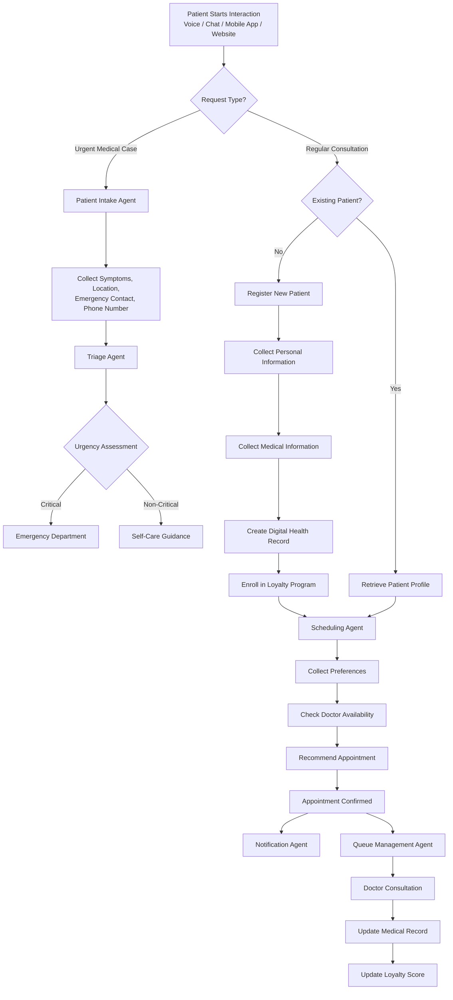
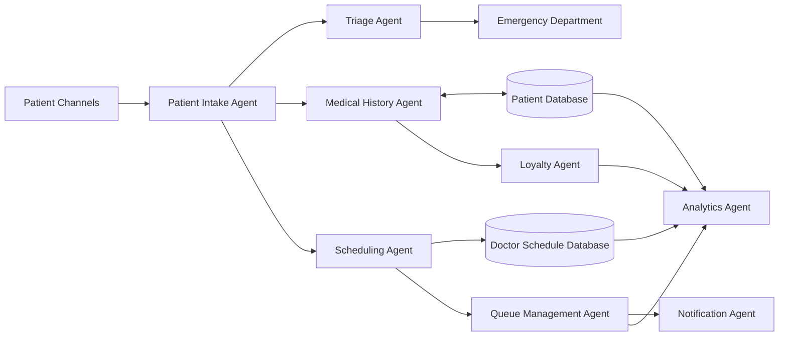
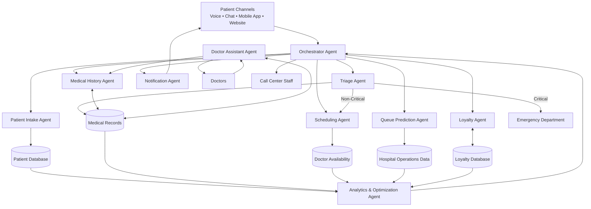

#  Agentic Healthcare Patient Management System

> An AI-powered multi-agent healthcare platform designed to reduce wait times, improve patient experience, optimize hospital operations, and maintain comprehensive patient medical records.

---

#  Overview

Healthcare providers face significant operational challenges that impact both patient satisfaction and healthcare efficiency. Traditional systems often rely on manual processes, disconnected patient records, overloaded call centers, and static scheduling systems.

This project introduces an **Agentic AI Healthcare Patient Management System**, a multi-agent platform where specialized AI agents collaborate to automate patient intake, triage, scheduling, queue management, medical history maintenance, notifications, and patient engagement.

At the center of the system is an **Orchestrator Agent** that coordinates all other agents and ensures smooth execution of healthcare workflows.

---

#  Problem Statement

Hospitals and clinics frequently face the following challenges:

##  Long Wait Times

Patients spend excessive time:

* Waiting for call center responses
* Waiting for appointment availability
* Waiting inside clinics before consultations

##  Poor Appointment Visibility

Patients often struggle to find suitable doctors and available appointment slots.

##  Incomplete Medical History

Medical information is often fragmented across visits and departments, making it difficult to provide personalized care.

##  Difficulty Prioritizing Urgent Cases

Emergency and high-risk patients may not be identified quickly enough.

##  Weak Patient Loyalty & Retention

Most healthcare systems lack effective mechanisms to encourage follow-up visits and preventive care.

##  Operational Inefficiencies

Hospital administrators often have limited visibility into:

* Resource utilization
* Patient flow
* Scheduling bottlenecks
* Demand forecasting

---

#  Why This Solution?

Instead of relying on a single AI assistant, this solution uses a **Multi-Agent Architecture** where each agent specializes in a specific healthcare function.

This approach enables:

* Faster response times
* Better decision making
* Parallel task execution
* Personalized patient experiences
* Continuous optimization of hospital operations

### Expected Impact

| Challenge                   | AI Agent Solution      |
| --------------------------- | ---------------------- |
| Long call center wait times | Patient Intake Agent   |
| Emergency prioritization    | Triage Agent           |
| Missing patient history     | Medical History Agent  |
| Scheduling conflicts        | Scheduling Agent       |
| Long clinic queues          | Queue Prediction Agent |
| Low patient retention       | Loyalty Agent          |
| Operational bottlenecks     | Analytics Agent        |

---

#  Patient Journey Flow



---

#  Core Agent Architecture



---

#  Advanced Agentic Architecture



---

#  Enterprise / Hackathon-Level Architecture

```text
Experience Layer
├── Voice Assistant
├── Mobile Application
├── Web Portal
└── Call Center

        ↓

Agent Layer
├── Orchestrator Agent
├── Patient Intake Agent
├── Triage Agent
├── Medical History Agent
├── Scheduling Agent
├── Queue Prediction Agent
├── Notification Agent
├── Loyalty Agent
├── Doctor Assistant Agent
└── Analytics & Optimization Agent

        ↓

Data & Systems Layer
├── Electronic Health Records (EHR)
├── Patient Database
├── Doctor Scheduling System
├── Hospital Operations Data
├── Loyalty Database
└── Reporting Dashboard
```

---

# 🎭 Agent Responsibilities

## 1. Orchestrator Agent

The central coordinator responsible for:

* Routing requests between agents
* Managing workflows
* Sharing context
* Handling escalations
* Monitoring execution

---

## 2. Patient Intake Agent

Responsible for:

* Patient onboarding
* Information collection
* Authentication
* Intent detection

### Output

* Structured patient profile

---

## 3. Triage Agent

Responsible for:

* Symptom assessment
* Severity classification
* Emergency detection

### Output

* Priority score
* Emergency recommendation
* Self-care guidance

---

## 4. Medical History Agent

Responsible for:

* Medical record creation
* Health history management
* Diagnosis tracking
* Prescription storage

### Output

* Updated patient profile

---

## 5. Scheduling Agent

Responsible for:

* Appointment booking
* Doctor matching
* Availability optimization
* Capacity balancing

### Output

* Recommended appointment slots

---

## 6. Queue Prediction Agent

Responsible for:

* Wait time prediction
* Queue optimization
* Delay monitoring
* Appointment flow management

### Output

* Real-time queue updates

---

## 7. Notification Agent

Responsible for:

* Appointment reminders
* Queue alerts
* Follow-up notifications
* Emergency communications

### Output

* SMS
* Email
* Push Notifications
* Voice Notifications

---

## 8. Loyalty Agent

Responsible for:

* Loyalty score management
* Reward allocation
* Patient retention tracking

### Output

* Loyalty points
* Personalized rewards

---

## 9. Doctor Assistant Agent

Responsible for:

* Patient summaries
* Clinical note generation
* Follow-up recommendations

### Output

* Consultation summaries
* AI-assisted documentation

---

## 10. Analytics & Optimization Agent

Responsible for:

* Demand forecasting
* Bottleneck detection
* Resource optimization
* KPI monitoring

### Output

* Operational insights
* Optimization recommendations

---

#  Expected Benefits

* Reduced patient wait times
* Faster appointment scheduling
* Improved emergency prioritization
* Better patient satisfaction
* Increased patient loyalty
* More efficient doctor utilization
* Reduced administrative workload
* Data-driven hospital operations
* Improved healthcare outcomes

---

#  Future Enhancements

* Wearable device integration
* AI-powered diagnosis assistance
* Predictive patient risk scoring
* Telemedicine support
* Insurance claim automation
* Multi-hospital interoperability
* Generative AI clinical assistant
* Predictive staffing optimization

---

**Built with Agentic AI, Multi-Agent Systems, Healthcare Analytics, and Intelligent Workflow Automation.**
